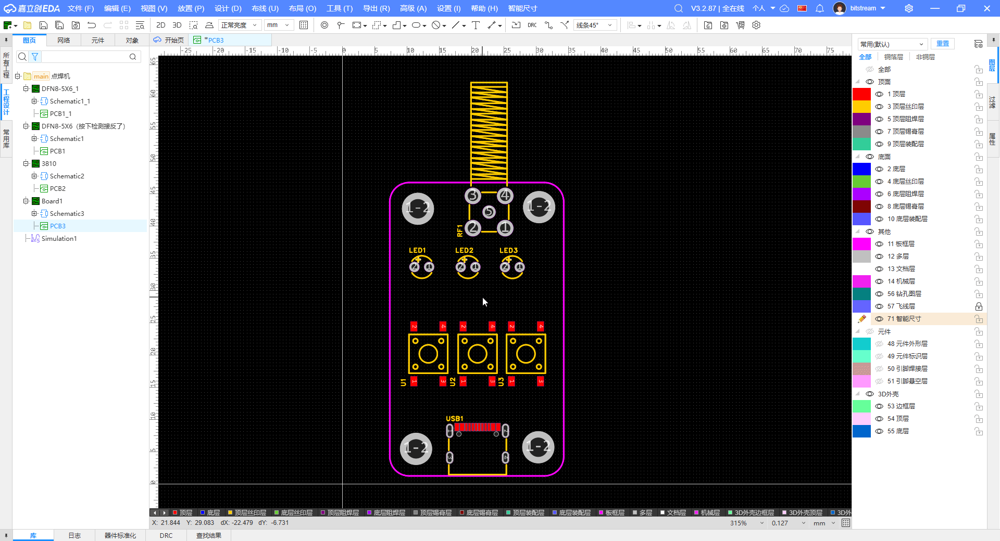
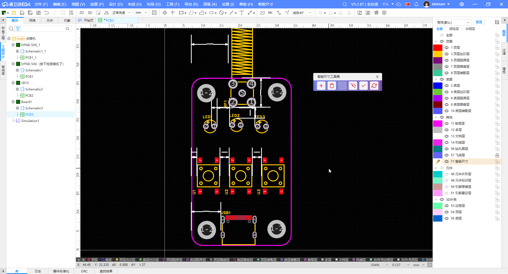
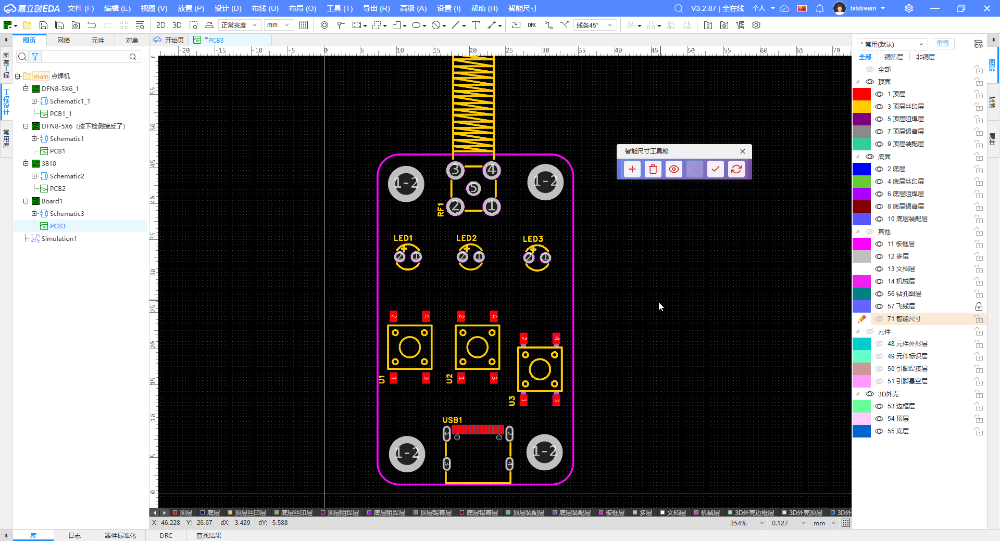
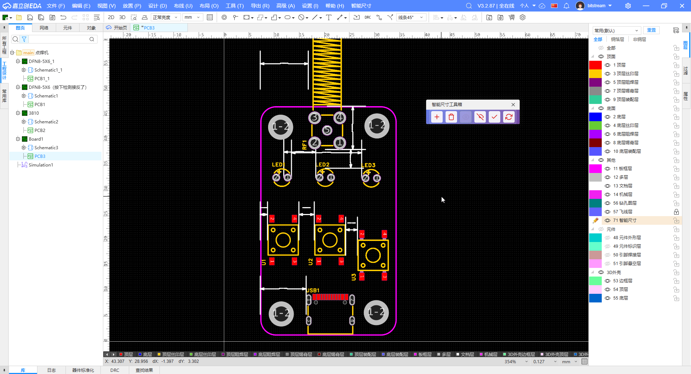

## 功能描述

在设计过程中，有定位孔或者按键等需要固定位置的元件时，仅仅通过尺寸工具和测量工具，手工拖动元件，不仅麻烦，多少还会存在一些误差；如果通过计算好所有元件的具体位置，再从参数中输入，这样虽然可以确保元件的位置准确，但是如果后续需要修改设计，就需要重新计算，工作量比较大，还不直观。

有了这个工具，就可以在设计过程中，通过简单的操作，就可以自动调整元件的位置，确保元件之间的距离符合要求。

和尺寸工具和测量工具不同，这个工具直接把两个元件关联起来，当一个元件的位置改变时，另一个元件的位置也会自动改变。

有了这个工具，元件的位置开始变得确定，不会再有误差，再也不需要心里七上八下地拿着卡尺对着PCB去量。

## ✅ 添加智能尺寸

## ✅ 修改并应用尺寸

## ✅ 根据当前位置重建智能尺寸

## ✅ 隐藏智能尺寸

## ✅ 显示智能尺寸

## ✅ 清空智能尺寸

## 开源许可

本开发工具组使用 [Apache License 2.0](https://choosealicense.com/licenses/apache-2.0/) 开源许可协议，你仅可以将 **嘉立创EDA**、**EasyEDA** 商标信息用于依托于本工具组开发的扩展包的 **功能描述部分** 和 **开源发布的标题部分**。
